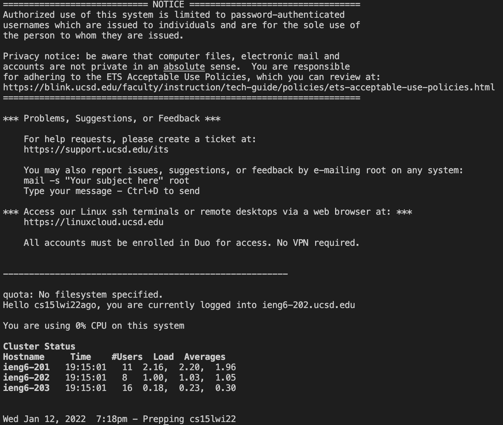
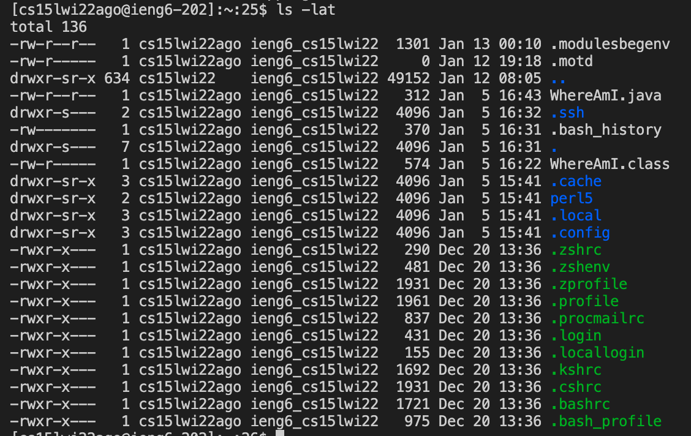
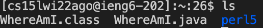
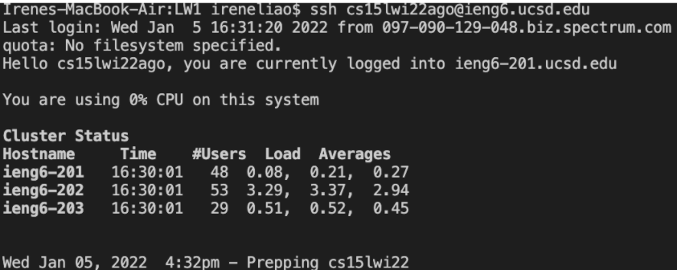
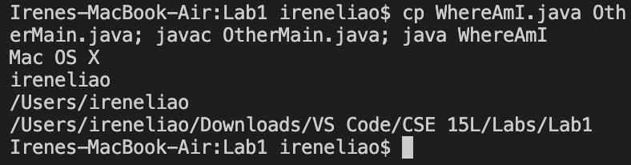

# Hello!
## This is a tutorial on how to log into a *course-specific* account on `ieng`.

>What is "ieng"?
>>"ieng6" or more specifically, ieng6.ucsd.edu, is the name of a domain that allows students to access UCSD from anywhere. 
 ---
# **1. Installing VSCode**
Install **Visual Studo Code** with this link: [VSCode](https://code.visualstudio.com/)

> What is VSCode used for?
>> VSCode is a simple code editor that is popular to use as it allows users to debug, run tasks, and more.

Once launched, you should see a screen similar to the one below:


---
# **2. Remotely Connecting**
In this section, we'll learn how to use VSCode to connect to a remote computer.

*If you're on Windows, you have to install OpenSSH with this link here: [OpenSSH](https://docs.microsoft.com/en-us/windows-server/administration/openssh/openssh_install_firstuse). It is a program that allows your computer to connect to other computers. This doesn't apply to non-Windows users.*

The first step is to look up your course-specific account for CSE15L with this link: [SDACS](https://sdacs.ucsd.edu/~icc/index.php).
* There, you should find your username, which should look something like "cs15lwi22zz."

The next step is to open VSCode to connect to the remote computer.

1. Open a terminal in VSCode (shortcut: Control/Command + `) and utilize the following command:

* `$ ssh cs15lwi22zz@ieng6.ucsd.edu`
>* *"zz" should be replaced with your speciifc account's username*
2. After running the command, you should see an output similar to this: ```The authenticity of host 'ieng6.ucsd.edu (128.54.70.227)' can't be established.
RSA key fingerprint is SHA256:ksruYwhnYH+sySHnHAtLUHngrPEyZTDl/1x99wUQcec.
Are you sure you want to continue connecting (yes/no/[fingerprint])? ```
>* Type in "yes" as it means that you're connecting to a new server for the first time. It should prompt you to type in your password after.
3. After, you should see an output similar to this:


**Congratulations! Your computer is now connected to one in the CSE department. Any commands you run now will run on that specific computer.**

---
# **Trying Some Commands**
Now that you're connected, try some commands both on your local computer as well as on the remote computer after committing "ssh." 
* *Tip: Pressing the "up" button on your keyboard will prompt the last executed command on terminal and saves you time!*

Commands to try:
* `cd ~`
* `cd`
* `ls -lat`
* `ls -a`
* `ls <directory>` with `<directory>` being `/home/linux/ieng6/cs15lwi22/cs15lwi22abc` and `abc` being another user's username
* `cp /home/linux/ieng6/cs15lwi22/public/hello.txt ~/`
* `cat /home/linux/ieng6/cs15lwi22/public/hello.txt`

Your output should look similar to this (`ls -lat` ran):


In order to return to your local computer's terminal, you can execute "Control - D" or type in `exit` as a command.

---
# **Moving Files with `scp`**
A benefit of using a remote computer is having the ability to *copy files back and forth between computers virtually.*

`scp` should be executed on your **local computer**, not the remote computer (command `exit` to exit remote computer).

Create a new file called `WhereAmI.java` with code provided by the professor.

To start the process of moving files, you must follow these steps:
1. Run `javac` and `java` on `WhereAmI.java` on your *local computer*.
2. In the same terminal (local computer), run the copy command: `scp WhereAmI.java cs15lwi22zz@ieng6.ucsd.edu:~/`
3. Log into the `ieng6` server via `ssh` and run the command `ls`.
>* The file should appear:
> 
4. Run `javac` and `java` on the *ieng6 computer* this time!

---
# **Setting an SSH Key**
Notice how tedious it is to continuously enter your password whenever running `ssh` or `scp`?

To ease this problem, we can create `ssh` keys that use your password as a file in order to speed up the process and get rid of the entering password bit.

1. On your *local computer*, run `$ ssh-keygen`.
>* Your output should be something like ```Generating public/private rsa key pair.
Enter file in which to save the key (/Users/joe/.ssh/id_rsa): /Users/joe/.ssh/id_rsa
Enter passphrase (empty for no passphrase): 
Enter same passphrase again: 
Your identification has been saved in /Users/joe/.ssh/id_rsa.
Your public key has been saved in /Users/joe/.ssh/id_rsa.pub.``` Enter the file path as your computer's specific path.
2. Now, `ssh` into the `ieng6` server again. After you enter your password, you should be able to log in or `scp` without having to input your password.
Example output:


---
# **Optimizing Remote Running**

In order to optimize remote running, you can figure out plenty of methods and strategies. 
* For example, using *semicolons* allow you to multi-task without having to individually run each command.

* Another example would be writing a command in quotes at the end of `ssh` to run it on the remote server.
> For example: `$ ssh cs15lwi22@ieng6.ucsd.edu "ls"`
---
# **And that's it! Happy coding! :)**