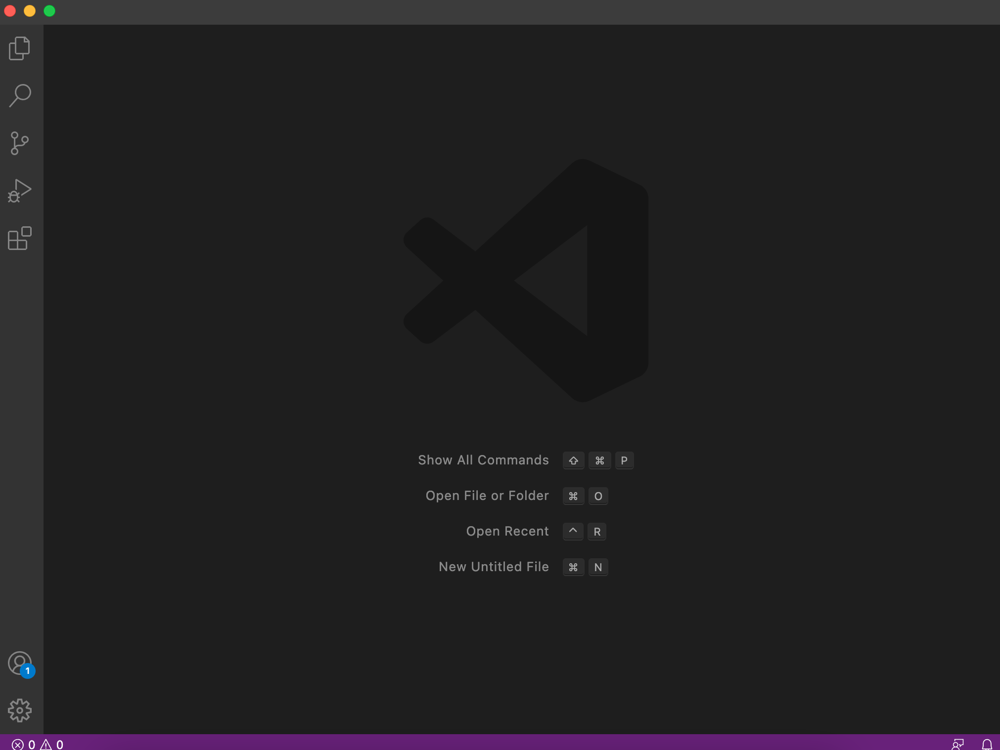

# Hello!
## This is a tutorial on how to log into a *course-specific* account on `ieng`.

What is "ieng"?
* "ieng6" or more specifically, ieng6.ucsd.edu, is the name of a domain that allows students to access UCSD from anywhere. 
 ---
# **1. Installing VSCode**
Install **Visual Studo Code** with this link: [VSCode](https://code.visualstudio.com/)

*What is VSCode used for?*
* VSCode is a simple code editor that is popular to use as it allows users to debug, run tasks, and more.

Once launched, you should see a screen similar to the one below:


---
# **2. Remotely Connecting**
In this section, we'll learn how to use VSCode to connect to a remote computer.

*If you're on Windows, you have to install OpenSSH with this link here: [OpenSSH](https://docs.microsoft.com/en-us/windows-server/administration/openssh/openssh_install_firstuse). It is a program that allows your computer to connect to other computers. This doesn't apply to non-Windows users.*

The first step is to look up your course-specific account for CSE15L with this link: [SDACS](https://sdacs.ucsd.edu/~icc/index.php).
* There, you should find your username, which should look something like "cs15lwi22zz."

The next step is to open VSCode to connect to the remote computer.

1. Open a terminal in VSCode (shortcut: Control/Command + `) and utilize the following command:

* `$ ssh cs15lwi22zz@ieng6.ucsd.edu`
>* *"zz" should be replaced with your speciifc account's username*
2. After running the command, you should see an output similar to this: ```The authenticity of host 'ieng6.ucsd.edu (128.54.70.227)' can't be established.
RSA key fingerprint is SHA256:ksruYwhnYH+sySHnHAtLUHngrPEyZTDl/1x99wUQcec.
Are you sure you want to continue connecting (yes/no/[fingerprint])? ```
>* Type in "yes" as it means that you're connecting to a new server for the first time. It should prompt you to type in your password after.
3. After, you should see an output similar to this:


**Congratulations! Your computer is now connected to one in the CSE department. Any commands you run now will run on that specific computer.**

---
# **Trying Some Commands**
