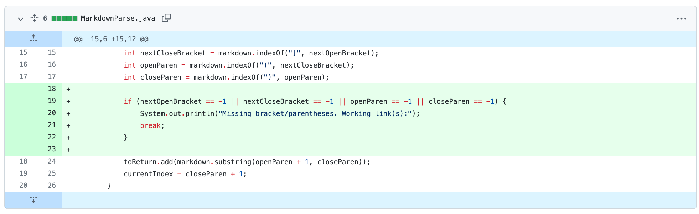
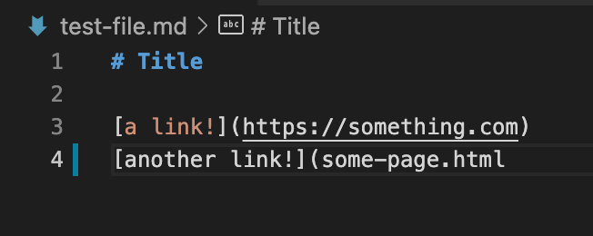
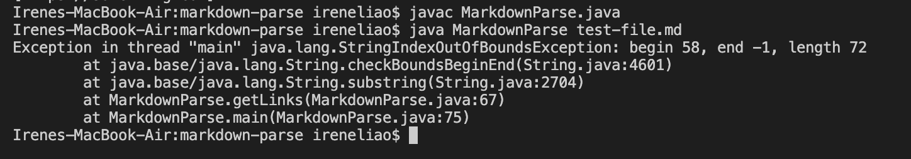
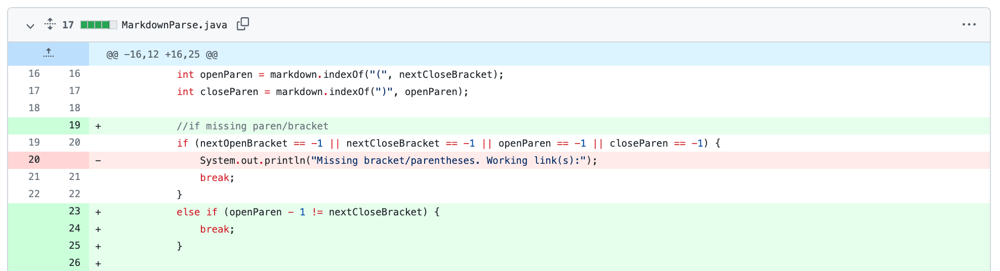
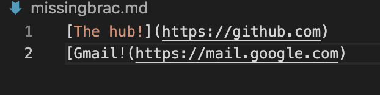
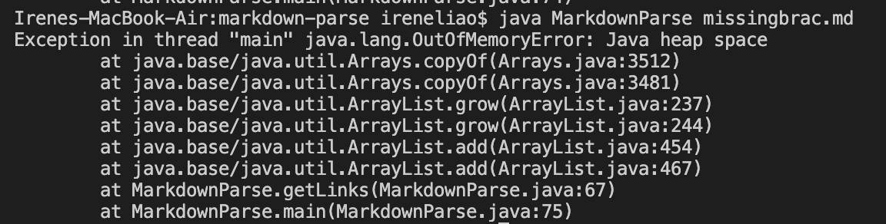
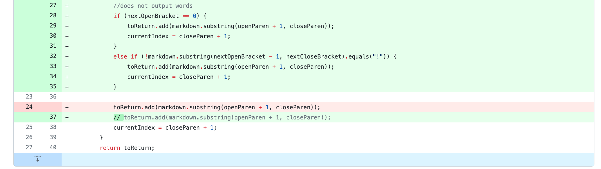
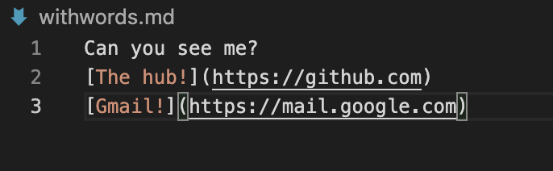
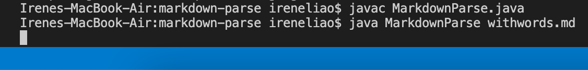

# Lab Report 2
Week 4 Lab Report

# **Code Change 1**
## **Code Change**
The first change my group and I committed was one that involved the bug of missing parentheses in test files.

## **Failure-Inducing Input File**
The failure-inducing input file looks like this:

Link to file:
[First Failure File](https://github.com/iireneliao/markdown-parse/blob/main/missingparen.md)

## **Symptom**
The symptom of the failure-inducing input was as such:

## **Relationship**
Without the code change, if a user missed a closing parenthesis to their links, the symptom would have been their output. Therefore, to debug that specific problem, the code change was implemented to avoid outputting a broken/incomplete link.

# **Code Change 2**
## **Code Change**
The second change my group and I committed was in relation to the first code change. However, it was an additional if condition to ensure correctness. This bug focused on missing brackets in test files.

## **Failure-Inducing Input File**
The failure-inducing input file looks like this:

Link to file:
[Second Failure File](https://github.com/iireneliao/markdown-parse/blob/main/missingbrac.md)

## **Symptom**
The symptom of the failure-inducing input was as such:

## **Relationship**
This code change focused on targetting issues with missing brackets, similar to code change 1 that focused on missing parentheses. So just like that, it avoids outputting a broken/incomplete link if a test file misses a closing bracket.

# **Code Change 3**
## **Code Change**
The third change my group and I committed was one that focused on *not* outputting words from test files and simply only links.

## **Failure-Inducing Input File**
The failure-inducing input file looks like this:

Link to file:
[Third Failure File](https://github.com/iireneliao/markdown-parse/blob/main/withwords.md)

## **Symptom**
The symptom of that failure-inducing input does not exist, which is the symptom. After 10 minutes of waiting for an output, the code does not allow the terminal to compile the MarkdownParse file with the test file with words. The symptom was as such:

## **Relationship**
The code change ensures the bug of having words inside the code still allows the program to run correctly. The code ensures that random characters inside the test file will not affect the correct output of the program.
