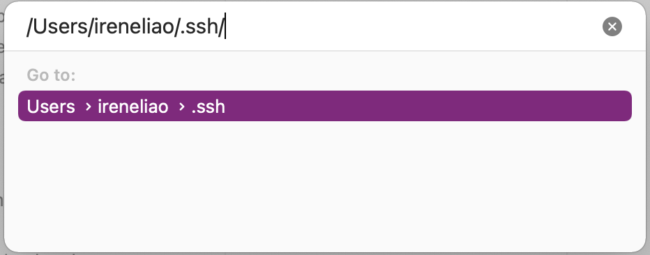
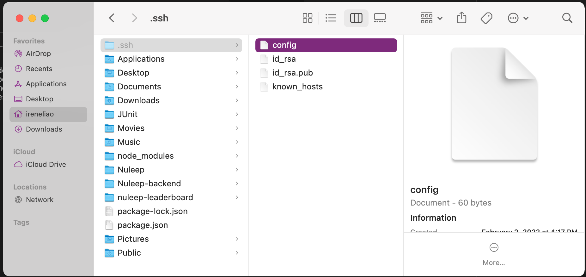
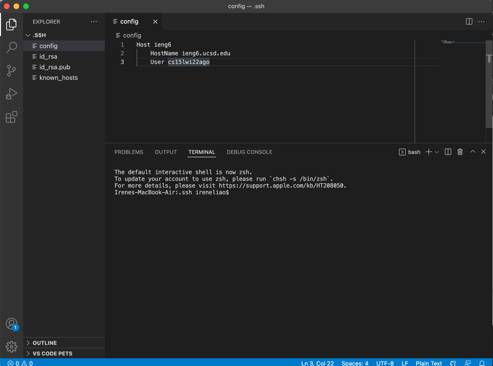
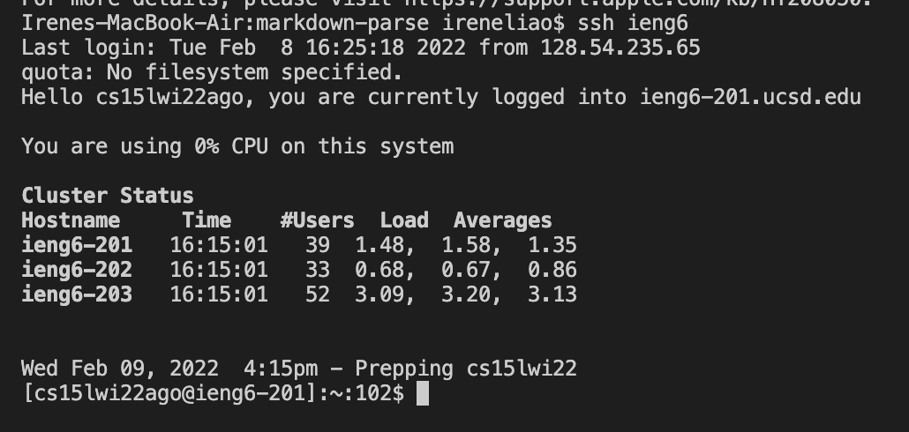
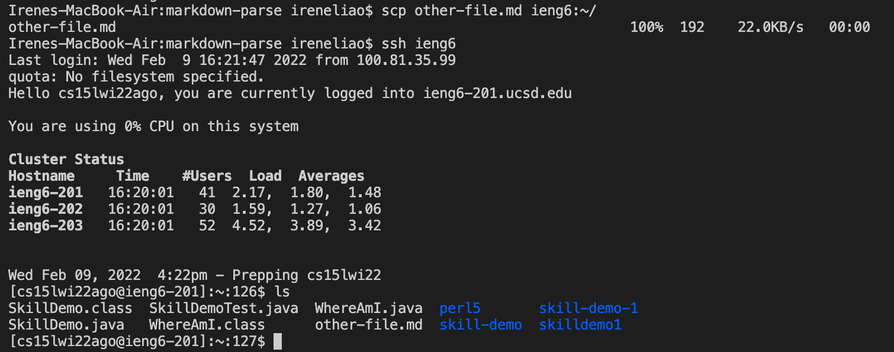

# **Lab Report 3**
Week 6 Lab Report

# **Streamlining `ssh` Configuration**

## **Finding .ssh/config file and editting it**
To find my .ssh folder, I went to my computer's file Finder and searched for the folder:

After I found where the folder was, I opened it on VS Code and created a new file called "config" (already pictured in the image):

Next, I inputted the necessary information into my config file shown below:

## **`ssh` Command Using Alias**
In this screenshot, I executed an `ssh` command using the alias I chose.

Using the alias instead of the usual `scp [file] cs15lwi22ago@ieng6.ucsd.edu:~/` saved a lot of time as well as keystrokes as I could sub out the `@ieng6` address for `ieng6`.

## **`scp` Command Using Alias**
In this screenshot, I executed an `scp` command using the alias I chose. You can also see that the copy of `other-file.md` into the ieng6 server was successful by using `ls` while in the server's directory.

Here, you can see that by copying the file with `ieng6` instead of the `@ieng6` address saved time and keystrokes as well.