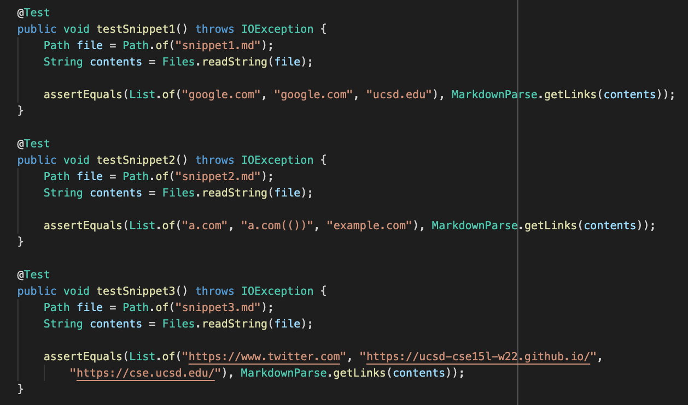
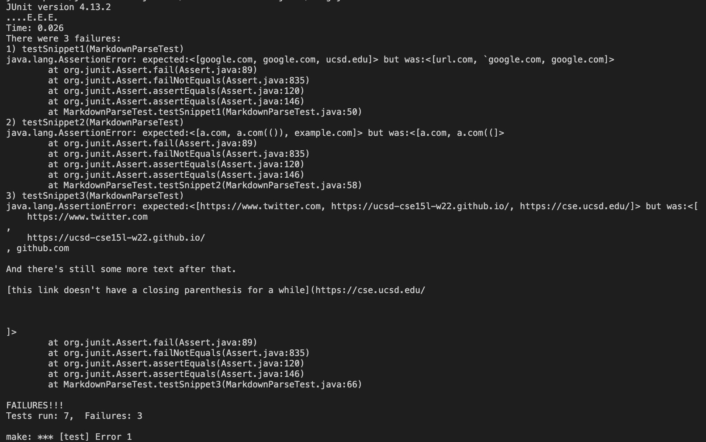
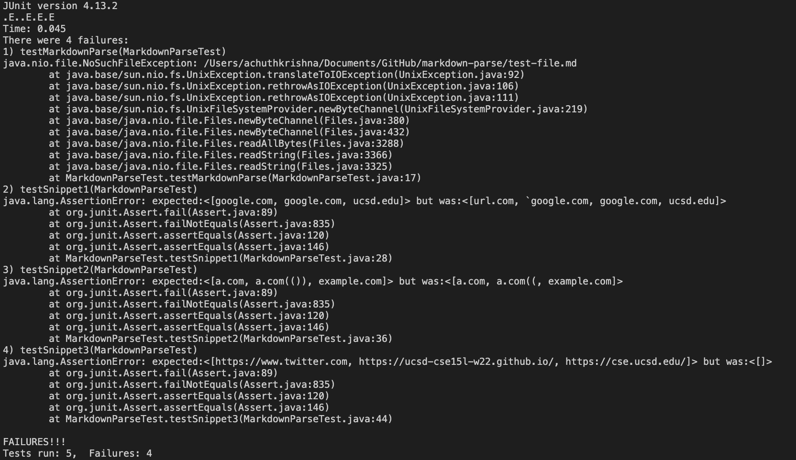

# **Lab Report 4**
Week 8 Lab Report

* Link to my implementation of markdown-parse: [My MarkdownParse](https://github.com/iireneliao/markdown-parse)
* Link to reviewed implementation of markdown-parse: [AchuthKrishna's MarkdownParse](https://github.com/AchuthKrishna/markdown-parse)

---

## **JUnit tests ran for both implementations:**

*Expected values derived from valid and working links in VSCode's preview tool.*

---

## **Output of my implementation:**

The 3 tests for the snippets failed as you can see in the output where it says `java.lang.AssertionError` as the expected values did not match the actual values.

---

## **Output of reviewed implementation:**

The 3 tests for the snippets failed, including another test apart from the snippets. The 3 tests that failed is where the output states `java.lang.AssertionError` as the expected values did not match the actual values.

---
## **Questions**

Would a small code change fix the program for snippet1?
* I think a small code change would fix my program for snippet1. The problem was that it counted url.com as a valid link when it shouldn't because of the markdown use of the grave symbol (`). When previewing snippet1.md, all of the links are valid except for url.com. However, my program counted url.com as a link and did not count ucsd.edu as a link because of the nested bracket. Therefore, I do think it would be a small code change to cover brackets inside the main brackets as well as not outputting the link if there are graves outside of the brackets.

Would a small code change fix the program for snippet2?
* I believe a more involved code change would be needed to fix the program for snippet2. This snippet involves a nested link, but it seemed as that my program caught it and outputted the correct answer. However, the nested parenthesized url and escaped brackets url are what went wrong with my program. My program only noticed "a.com((" for the parenthesized url when it should've outputted "a.com(())." I would have to account for when there are multiple close parentheses in the link since that link is valid according to preview. For the escaped brackets, my program did not recognize it and therefore did not output that link. Since there was 2 close brackets and my program accounts for when there is an open parenthesis right after a close bracket, since the first close bracket is not before an open parenthesis, my program did not output it. Therefore, with all of these observations I believe a more involved code change would be needed.

Would a small code change fix the program for snippet3?
* I believe a much more involved code change is needed to fix the program for snippet3. Due to the text taking up more than 1 line, it confused my program and instead practically outputted the whole markdown file instead as its actual value. Therefore, I would have to account for situations where a link line takes up more than 1 line in the markdown file, which presumably will take more than 10 lines of code change because I would have to consider when a line breaks and when it breaks in between parenthesis or brackets or other combinations.