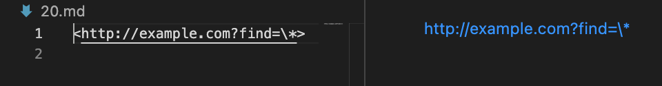
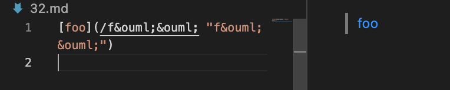
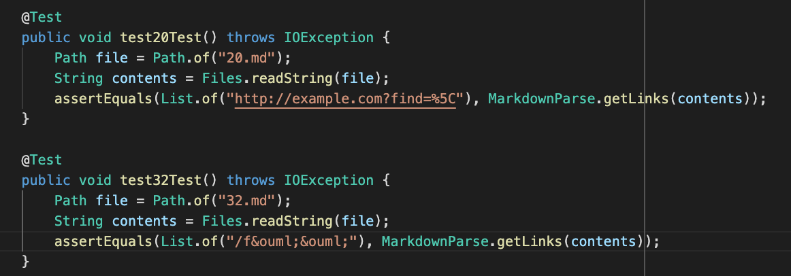
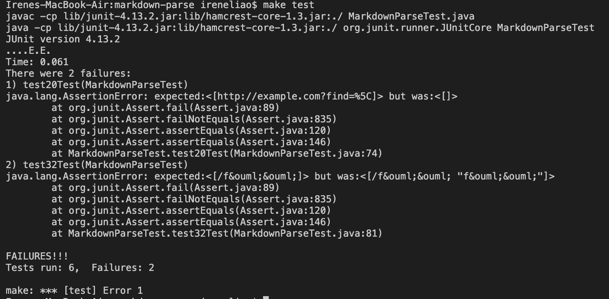
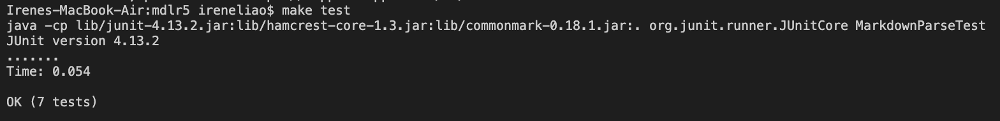
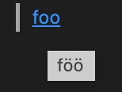
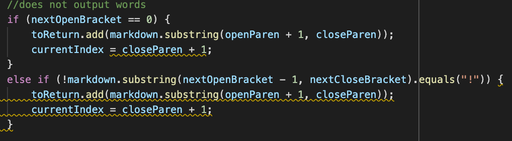

# **Lab Report 5**
Week 10 Lab Report

* Test files chosen: 20.md and 32.md
* Explanation of files chosen:
    * I chose the test files through a manual strategy. I had searched in the test-files folder of Lab 9's Markdown Parse repository and filtered the search to only show .md files. From there, I peeked at the test files until I saw some that would seem to fail tests. Particularly, I searched for .md files that included some sort of links. The reason for this is because I had tested one of the test files that only consisted of words and both my implementation and the course's implementation had the same output. When I encountered 20.md and 32.md, I noticed that they had failed my implementation and not the course's.

---

## **20.md**

*20.md's test file provides a working link according to VSCode's preview tool.*

---

## **32.md**

*32.md's test file provides a working link according to VSCode's preview tool.*

---

## **JUnit tests ran for both implementations:**

*Expected values derived from valid and working links in VSCode's preview tool.*

---

## **Output of my implementation:**

Both tests failed for reasons stated above.

---

## **Output of course implementation:**

All tests passed.

---

## **20Test()**
For the JUnit test for 20.md, I believe the course's implementation is correct and mine is not. I'm under the assumption that the course's implementation accounts for HTML links as well as links in the markdown format. I'm assuming the link *is* actually a link since VSCode's preview tool views it as one. Since my implementation does not account for links that are not in the format of brackets and parentheses. Therefore, I believe the course's implementation is correct.

---

## **20Test() Bug**
In the previous section, I mentioned that my implementation is incorrect. The bug is that my implementation does not account for HTML links as it only accounts for links strictly in the markdown file format. There isn't a specific code in my program that can be shown to be fixed as it doesn't exist in my code. Therefore, I would add an additional if condition to validate links that are in the HTML formats.

---

## **32Test()**
For the JUnit test for 32.md, I believe neither implementations should be working as supposed to. While the course implementation passed the test and my implementation just prints out whatever is inside the parentheses, I do not believe they're supposed to work in that way. Realistically, the content inside the parentheses does not equate to a valid and working link. VSCode's preview tool views the first half as a link but realistically, it is not a valid link. It possesses quotation marks and semicolons in seeemingly inappropriately places. Additionally, I hovered over the link, which should appear a link below, but that was not what I received. I received this:

Instead, I received a word with special characters and clicking on it goes to nowhere. Therefore, with all of my personal reasoning, I do not believe the two implementations are working as they should be.

---

## **32Test() Bug**
In the previous section, I mentioned that I believe both implementations are incorrect. Since I believe this, I'll be choosing my personal implementation to correct. The bug I believed to be true was that my implementation does not account for invalid links, or in this case, links that include additional/unnecessary spaces, quotation marks, and semicolons. I would put an if condition somewhere here in my code:

The if condition would account for spacees inside a link input as well as quotation marks, because realistically, links do not consist of quotation marks inside itself. The semicolon is a bit more complicated because some links do include semicolons, so I would save that for a future implementation. In an incredibly complicated and hypothetical situation where I would fix this code, I would see if the links actually go somewhere even if VSCode's preview tool deems it as a link. If the link doesn't go anywhere, like 32.md, then it would not be printed out. 